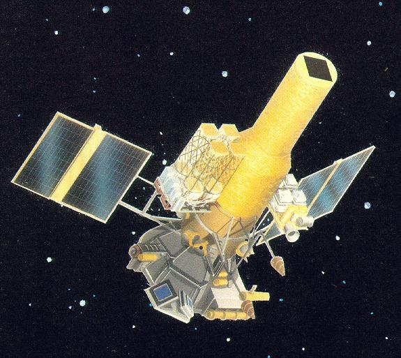
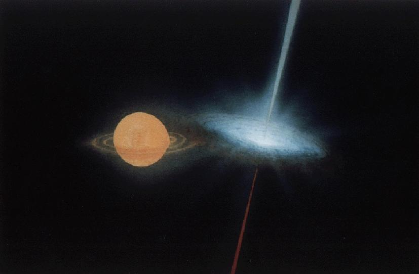
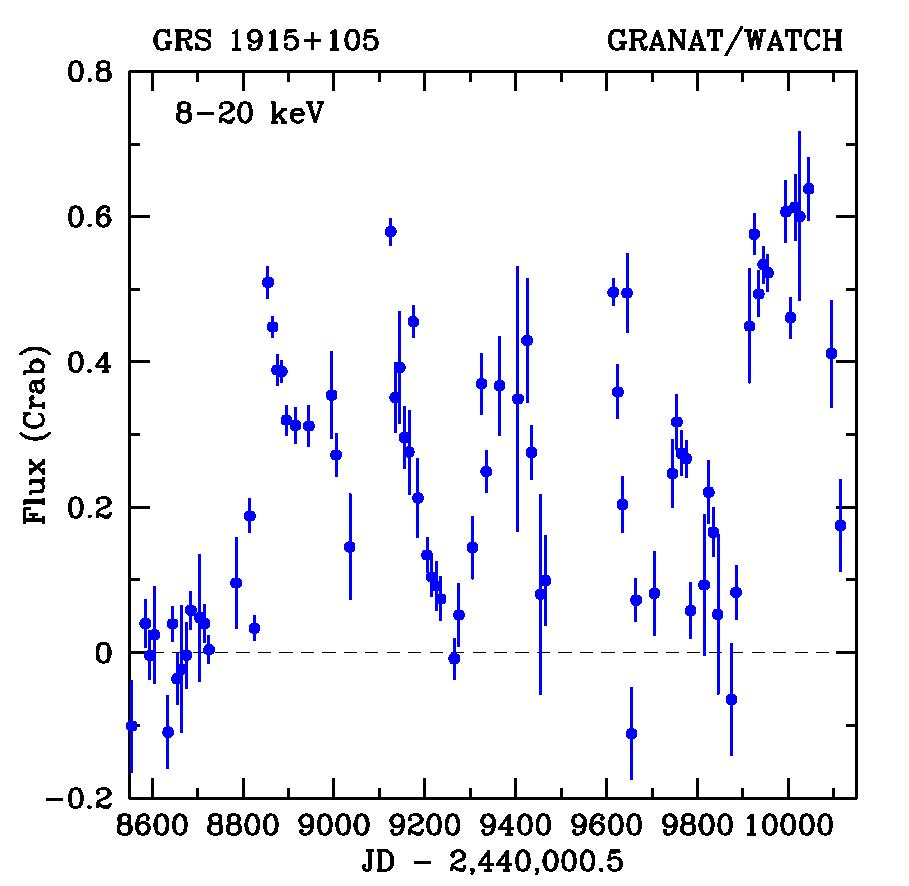

# МЕЖДУНАРОДНАЯ АСТРОФИЗИЧЕСКАЯ ОБСЕРВАТОРИЯ “ГРАНАТ”

Комплекс научной аппаратуры для проекта «Гранат» разработали в 80-х годах СССР, Франция, Дания и Болгария. В состав специализированной астрофизической обсерватории вошло семь приборов: французский гамма-телескоп с кодированной апертурой Sigma, рентгеновский телескоп с кодированной апертурой АРТ-П, рентгеновский спектрометр АРТ-С, датский рентгеновский монитор всего неба WATCH, два прибора для регистрации гамма -всплесков КОНУС и французский PHEBUS, и комплекс приборов на поворотной платформе «Подсолнух», разработанный совместно со специалистами из Болгарии. НПО им.С.А.Лавочкина изготовило космический аппарат, в основу которого был положен последний из двадцати шести аппаратов серии «Венера». Первого декабря 1989 года с космодрома Байконур ракетой «Протон» была выведена обсерватория «Гранат» на орбиту со следующими параметрами: апогей – 200000 км, перигей 500 км, период – 4 суток, наклонение 51°.5 (см. также раздел [Навигационная поддержка миссии Гранат](http://arc.iki.rssi.ru/granat/granat.html)). Космический аппарат имел трехосную «солнечно-звездную» ориентацию, точность наведения 5' и стабилизации ±30'. Раз в сутки из Центра Дальней Космической Связи под Евпаторией проводился сеанс связи с аппаратом, во время которого осуществлялось управление космическим аппаратом, переориентация аппарата на новый объект исследований и сброс научной информации, накопленной между сеансами связи.

### **Рентгеновский телескоп АРТ-П**

Телескоп АРТ-П состоит из четырех полностью идентичных, сонаправленных модулей, установленных на общей платформе. В состав модуля входит маска, поддерживающая легкая ферма из углепластика, многопроволочная пропорциональная камера с коллиматором и блоками аналоговой и цифровой электроники. Кодирующая маска изготовлена из медной пластины толщиной 1.5 мм и состоит из 4х4 = 16 одинаковых мотивов. Один мотив включает 43х41 = 1763 элементов. Прибор разработан и изготовлен в ИКИ АН СССР (г. Фрунзе).

Кодирующая маска АРТ-П

МПК АРТ-П в вакуумной камере перед началом процедуры очистки гермозоны при высокой температуре

Функциями управления телескопом АРТ-П и обработкой информации занимался микропроцессор с емкостью ОЗУ 64 Кбайта. Помимо электрического интерфейса со служебными системами космического аппарата, АРТ-П имел канал для обмена информацией с французским телескопом Sigma и запоминающей системой «Старт». По этому каналу осуществлялась передача научной информации из телескопа АРТ-П в долговременную память на цилиндрических магнитных доменах телескопа Sigma (на каждый модуль АРТ-П отводилось ~15 Мбит/сутки) или в систему «Старт» (~25Мбит/сутки). По каналу связи с телескопом Sigma телескоп АРТ-П принимал данные от звездного датчика, который определял мгновенную ориентацию космического аппарата с точностью >1'.

#### **Основные технические характеристики телескопа АРТ-П (одного модуля)**

| Энергетический диапазон для спектрометрии и временного анализа | 4-100 кэВ                                |
| -------------------------------------------------------------- | ---------------------------------------- |
| Энергетический диапазон для построения изображений             | 4-60 кэВ                                 |
| Полное поле зрения (FWZR)                                      | 3.o6x3.o6                                |
| Номинальное угловое разрешение                                 | 5'.2                                     |
| Точность локализации                                           | ~1'                                      |
| Эффективная площадь (с учетом затенения маской)                | 200 см2 на 6 кэВ                         |
| Энергетическое разрешение (FWHM)                               | 25% на 6 кэВ 15% на 60 кэВ               |
| Временное разрешение                                           | 1/256 с                                  |
| «Мертвое» время                                                | 580 мкс                                  |
| Уровень режекции заряженных частиц                             | >95%                                     |
| Тип детектора                                                  | Многопроволочная пропорциональная камера |
| Площадь входного окна детектора                                | 258x246 мм                               |
| Газовая смесь                                                  | 85%Xe+10%Ar+5%CO2                        |
| Давление газа                                                  | 1.3-1.5 бар                              |
| Пространственное разрешение (FWHM) на 6 кэВ по координате      |                                          |
| вдоль анодных проволочек                                       | 0.8 мм                                   |
| поперек анодных проволочек                                     | 0.5-1.8 мм                               |
| Толщина входного бериллиевого окна                             | 500 мкм                                  |
| Толщина «измерительного» слоя                                  | 48 мм                                    |
| Толщина «антисовпадательного» слоя                             | 24 мм                                    |
| Размер элемента маски                                          | 2x2 мм                                   |
| Площадь маски                                                  | 344x328 мм                               |
| Расстояние между маской и входным окном детектора              | 1320 мм                                  |
| Масса модуля                                                   | 90 кг                                    |
| Энергопотребление модуля                                       | 37 Ватт                                  |

### **Наземная калибровка АРТ-П**

В ИКИ АН СССР был разработан и изготовлен специализированный стенд для наземной калибровки приборов. Основной частью стенда являлась 15-метровая труба из нержавеющей стали диаметром 60 см. Труба имела выходное окно диаметром 40 см и входное – диаметром 1 см. Окна были изготовлены из майларовой пленки толщиной 100 мкм. Для компенсации давления внешней атмосферы на выходное окно трубы была установлена поддерживающая стальная решетка. Система откачки обеспечивала внутренне давление в трубе не более 0.1 мм.рт.ст. Для того, чтобы избежать влияния рассеянного на внутренних стенках трубы излучения, внутри трубы были установлены две медные диафрагмы толщиной 6 мм с диаметром отверстий 13 см и 26 см на расстоянии 5 м и 10 м от входного окна трубы соответственно.  
Для трехкоординатного перемещения детектора использовалась ходовая часть станка, обеспечивающая точность <50 мкм по каждой из осей. Детектор можно было поворачивать в горизонтальной плоскости при помощи оптической делительной головки ОДГ-5 с точностью ~5".

###  **Гамма-телескоп SIGMA**

Французский гамма-телескоп SIGMA – самый большой инструмент обсерватории «Грант», весом около одной тонны, высотой 3.5 метра, диаметром 1.2 метра. Он состоит из кодирующей маски, позиционно-чувствительного детектора, и активной и пассивной защиты от фона. В состав телескопа также входили подсистемы, такие как «пузырьковая» память, бортовой компьютер, звездные датчики и т.д.

| Тип детектора                        | Один сцинтиллятор NaI(Tl) + 61 гексагональных фотоумножителей |
| ------------------------------------ | ------------------------------------------------------------- |
| Геометрическая площадь детектора     | 794 см2                                                       |
| Активная площадь детектора           | 540 см2                                                       |
| Расстояние между маской и детектором | 2.5 м                                                         |
| Поле зрения полного кодирования      | 4.3ox4.7o                                                     |
| Размер пикселя маски                 | 9.4x9.4 мм2 (49x53 элементов)                                 |
| Угловое разрешение (FWHM), по оси    | 13'                                                           |
| Энергетический диапазон              | 30-1500 кэВ                                                   |
| Энергетическое разрешение            | (FWHM) 8% на 511 кэВ                                          |

Кодирующая маска телескопа

Летная модель телескопа на испытаниях в безэховой камере, KHEC, Тулуза

Телескоп SIGMA на Байконуре

### Рентгеновский монитор всего неба WATCH

Прибор WATCH был разработан и изготовлен в Датском Институте Космических. На обсерваторию «Гранат» было установлено четыре монитора, поле зрение которых одновременно покрывало ~80% неба, при этом поле зрения одного монитора – конус с углом раствора 148o. В качестве детектора использовались чередующиеся сцинтилляционные пластинки из NaI и CzI. Геометрическая площадь одного детектора 47 см2. Прибор работал в двух энергетических диапазонах 8-20 кэВ и 20-60 кэВ. Для локализации в инструменте WATCH использовался принцип вращающегося модуляционного коллиматора. Точечный источник, сохраняющий свою яркость в течение одного периода вращения коллиматора (1 сек), мог быть локализован с точностью ~50/n10 угловых минут (на уровне 3s), где n10 – уровень сигнала от источника в единицах 10s.

Монитор WATCH во время наземной калибровки в ИКИ РАН
###  Детектор гамма-всплесков PHEBUS

Французский прибор для регистрации гамма-всплесков PHEBUS (Payload for High Energy BUrst Spectroscopy) был установлен на обсерваторию «Гранат». Он состоял из 6 кристаллов BGO диаметром 78 мм и длиной 120 мм каждый, расположенных в разных местах космического аппарата. Детекторы работали в широчайшем диапазоне энергий от 100 кэВ до 100 МэВ. PHEBUS предназначался для изучения спектрального поведения гамма-всплесков и их эволюции во времени.

###  Остальные приборы

Рентгеновский спектрометр АРТ-С, прибор для регистрации гамма-всплесков КОНУС и комплекс приборов на поворотной платформе «Подсолнух», к сожалению, по разным техническим причинам не смогли полноценно функционировать на орбите и практически не применялись для астрофизических исследований.

### Комплексные испытания приборов в ИКИ

### "Гранат" перед запуском на Байконуре

Б.С.Новиков (ИКИ) и В.П.Никифоров (НПО им.С.А.Лавочкина) на фоне «Граната» перед накаткой обтекателя

Заключительные операции с «Гранатом» на Байконуре

Французские специалисты Жак Шен, Пьер Мандру и Жак Поль на Байконуре

### ЦДКС

Из Центра Дальней Космической Связи под Евпаторией (Крым) осуществлялся контроль полетом и прием данных спутника «Гранат». Для приема информации была задействована 70-метровая антенна. Это позволило обеспечить высокое качество приема информации, уровень ошибок был ниже 10-6. В ЦДКС также проводился экспресс-анализ научной информации, поступающей с приборов.

# Результаты обсерватории "Гранат"

### Область Центра Галактики и Sgr A*

Начиная с первых экспериментов в 70-х годах, происхождение жесткого и переменного излучения области Центра Галактики оставалось одной из самых больших загадок. Большинство наблюдаемых явлений связывали со сверхмассивной (около 3 миллионов солнечных масс) черной дырой, расположенной в динамическом центре нашей Галактики. Появление результатов обсерватории ГРАНАТ, исследовавшей рентгеновское и гамма излучение этой области с высоким угловым разрешением, позволило снять ряд вопросов. В частности, оказалось, что светимость самого Центра Галактики в рентгеновском диапазоне ничтожно мала – не более одной десятимиллионной от критической Эддингтоновской для объекта с массой 3*106 масс Солнца. Доминирующими источниками рентгеновского излучения в этой области оказались компактные источники, разбросанные вокруг Центра на угловом расстоянии в несколько градусов. Карты, полученные телескопами ГРАНАТа, на протяжении почти 10 лет (в 90-х годах) оставалась наиболее подробными в рентгеновской астрономии.

Суммарная карта области Центра Галактики, полученная телескопом АРТ-П в диапазоне 4-20 кэВ в период 1990-1991 гг.

Изображение области Галактического Центра, полученное за 8 лет наблюдений телескопом SIGMA в диапазоне 35-75 кэВ
### Природа диффузного излучения в области Галактического Центра, «рентгеновская археология»

По данным ГРАНАТа впервые была получена карта протяженного диффузного рентгеновского источника в области Галактического Центра в различных энергетических диапазонах и, что особенно важно, в диапазоне энергий выше 10 кэВ. Было обнаружено отличие формы этого источника на малых и жестких энергиях, а также корреляция его формы на жестких энергиях с картой плотных холодных молекулярных облаков, в частности – с облаком Sgr B. Было впервые высказано предположение, что должна наблюдаться флуоресцентная линия железа 6.4 кэВ и сильное поглощение в направлении облака Sgr В (что впоследствии было подтверждено спутником ASCA), а также - что по светимости в жестком рентгеновском диапазоне от холодных молекулярных облаков (в частности - Sgr B) можно судить об активности в прошлом Галактического Центра - на временном масштабе 300-400 лет («рентгеновская археология»). И действительно, вспышка активности ГЦ, примерно в 10 тыс. раз превышающей нынешнюю, позднее была открыта гамма-обсерваторией ИНТЕГРАЛ по спектру от Sgr B.

Изображение области центра Галактики, полученное телескопом АРТ-П. Слева – исходное, в центре и справа - диффузный источник (после вычитания точечных рентгеновских источников, их положение помечено крестиками) в двух энергетических диапазонах - в линии железа 5-8.5 кэВ (в центре) и в жестком диапазоне энергий 12-17 кэВ (справа). На изображении справа тонкими контурами нанесена радио карта 13СО 2.6 мм молекулярной линии.

### Открытие квазипериодических осцилляций у черных дыр

Телескопом АРТ-П были зафиксированы квазипериодические осцилляции рентгеновского потока от рентгеновских Новых в созвездиях Мухи и Персея и источника GX339-4, также являющихся кандидатами в черные дыры. Таким образом было доказано, что квазипериодические осцилляции потока рентгеновского излучения не являются исключительной особенностью нейтронных звезд, а могут возникать в аккреционных дисках вокруг черных дыр в результате гидродинамических и тепловых неустойчивостей. К настоящему времени квазипериодические осцилляции наблюдаются от многих аккрецирующих черных дыр.  
Значительный вклад в современные представления о проявлениях аккрецирующих черных дыр внесло открытие спутником ГРАНАТ квазипериодических осцилляций рентгеновского потока от источника Лебедь Х-1 – одного из наиболее хорошо изученных кандидатов в черные дыры в нашей Галактике.

На левом рисунке - спектр мощности кандидата в черные дыры GX339-4, построенный по наблюдениям телескопа АРТ-П за 2 апреля 1990 г. Хорошо виден пик на частоте 0.8 Гц – этот источник стал вторым кандидатом в черные дыры, у которого удалось обнаружить низкочастотные квазипериодические осцилляции. На правом рисунке - спектр мощности источника Лебедь Х-1, построенный по наблюдениям телескопа SIGMA в марте 1990 г.

### Аннигиляционная линия 511 кэВ

В октябре 1990 г. телескопом SIGMA в области Галактического Центра была зарегистрирована вспышка в аннигиляционной e+-e- линии  511 кэВ, которую вскоре идентифицировали с источником 1E1740.7-2942, названным впоследствии «Великим Аннигилятором». После этого в направлении на 1E1740.7-2942 было обнаружено гигантское молекулярное облако и переменный радиоисточник с джетоподобными структурами.

Энергетические спектры «Великого аннигилятора» 1E1740-294 по данным телескопов SIGMA и АРТ-П. Слева – усредненные за 1990 г., справа – за 13-14 октября 1990 г. (хорошо видна линия 511 кэВ).

Спектр  рентгеновской новой в Мухе по данным телескопов АРТ-П и SIGMA (20-21 января 1991 г.), в котором также обнаружена линия 511 кэВ

### **Изучение нейтронных звезд и черных дыр**

За восемь лет работы обсерватория открыла около двадцати неизвестных ранее источников рентгеновского излучения – кандидатов в черные дыры и нейтронных звезд. Название этих источников начинается с букв «GRS» -- GRANAT source --  источник ГРАНАТа.  
Спутником ГРАНАТ были получены спектры более десятка аккрецирующих черных дыр в широчайшем диапазоне энергий – от 2 до 800 кэВ. Эти источники характеризуются самыми жесткими спектрами из наблюдавшихся обсерваторией ГРАНАТ, что делает жесткость спектра важнейшим критерием диагностики природы релятивистского объекта в двойной системе.

Энергетический спектр рентгеновского барстера Terzan 1 в «мягком» и «жестком» состояниях по данным телескопов АРТ-П и SIGMA.

Изображения Галактической плоскости, полученные телескопом SIGMA в диапазоне 35-100 кэВ

Энергетические спектры на энергиях свыше 35 кэВ нескольких рентгеновских двойных с разной природой компактного объекта, наблюдавшихся телескопом SIGMA.
### Микроквазар в нашей Галактике

В августе 1992 г. иструмент WATCH обсерватории ГРАНАТ открыл новый источник рентгеновского излучения GRS1915+105.  Примерно в то же время  жесткое рентгеновское излучение от этого источника наблюдалось телескопом SIGMA/ГРАНАТ. Наблюдения телескопа SIGMA позволили локализовать источник с точностью 3 угл.мин. Позднее GRS1915+105 был отождествлен с переменным источником радио и инфракрасного излучения, причем вариации потоков в радио и рентгеновском диапазонах, по-видимому, скоррелированы. В 1994 г. инструмент WATCH обнаружил две мощные вспышки рентгеновского излучения от этого источника – в марте и сентябре, продолжительностью 2-3 недели каждая. Оперативная информация о мартовской вспышке, распространенная по каналам Международного Астрономического Союза, позволила французским радиоастрономам при помощи крупнейшего американского телескопа VLA обнаружить разлет двух облаков от центрального объекта со сверхсветовой видимой скоростью. GRS1915+105 стал первым «микроквазаром», открытым в нашей Галактике. Сейчас известно уже несколько источников подобного типа.

Модель источника GRS1915+105 – аккреция на чёрную дыру вещества со звезды – компаньона.

Кривая блеска GRS1915+105 по данным рентгеновского монитора WATCH.

Сверхсветовой разлёт джетов микроквазара GRS1915+105 по данным радионаблюдений

### Наблюдения послесвечений от гамма-всплесков

По данным телескопа SIGMA и спектрометра PHEBUS были обнаружены послесвечения гамма-всплесков в мягком гамма-диапазоне. Высокая чувствительность этих приборов позволила впервые увидеть слабое затухающее излучение после ярких гамма-всплесков. По-видимому, таким образом наблюдается начало автомодельной стадии торможения ультрарелятивистского выброса в источнике гамма-всплеска.  

Кривая блеска послесвечения от яркого гамма-всплеска 23 июля 1992 г. Нулевое время соответствует моменту срабатывания триггера.

### Синтез дейтерия во время солнечной вспышки

ГРАНАТ зарегистрировал ряд вспышечных событий, произошедших в период очередного максимума Солнечной активности в 1990-1991 гг. Среди зарегистрированных событий следует отметить серию вспышек от активной области 6063 на Солнце. Данные, полученные обсерваторией, говорят о том, что во время солнечных вспышек на поверхности Солнца может происходить активный процесс синтеза легких ядер. Во время только одной вспышки 24 мая 1990 г. в поверхностных слоях Солнца было синтезировано более трех тонн дейтерия. ГРАНАТ зафиксировал при этом около 150 тыс. фотонов в гамма-линии синтеза дейтерия с энергией 2.2 МэВ.

Кривые блеска солнечной вспышки 24 мая 1990 г., построенные по данным прибора PHEBUS в разных энергетических диапазонах. Начало отсчета соответствует моменту времени 20ч46м23с UTС.

### Картографирование рентгеновского неба

Экспозиционная карта наблюдений телескопом SIGMA в режиме трехосных наведений в течение 5 лет. Яркое пятно посередине – область Галактического Центра. Экспозиции увеличиваются от синего цвета к белому.

Пример карты покрытия небесной сферы, полученной за 1 год телескопом SIGMA в сканирующем режиме наблюдений в диапазоне 40-70 кэВ. В этом режиме ГРАНАТ работал с 1994 г.